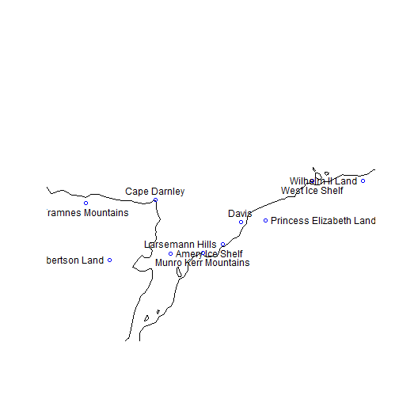
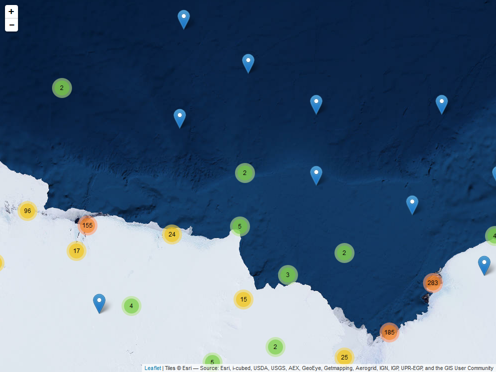
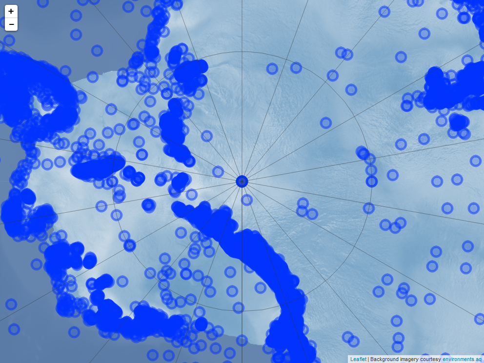

<!-- README.md is generated from README.Rmd. Please edit that file -->
antanym
=======

[](https://travis-ci.org/SCAR/antanym) [](https://ci.appveyor.com/project/SCAR/antanym)

Overview
--------

This R package provides easy access to Antarctic geographic place name information. Currently it uses the Composite Gazetteer of Antarctica (but may be expanded to other sources, such as subantarctic gazetteers, at a later date).

The SCAR Composite Gazetteer of Antarctica (CGA) was begun in 1992 and consists of approximately 37,000 names corresponding to 19,000 distinct features. These place names have been submitted by the national names committees from 22 countries. Since 2008, Italy and Australia have jointly managed the CGA, the former taking care of the editing, the latter maintaining the database and website. The SCAR [Standing Committee on Antarctic Geographic Information (SCAGI)](http://www.scar.org/data-products/scagi) coordinates the project.

This R package is a product of the SCAR [Expert Group on Antarctic Biodiversity Informatics](http://www.scar.org/ssg/life-sciences/eg-abi) and SCAGI.

There is no single naming authority responsible for place names in Antarctica because it does not fall under the sovereignty of any one nation. In general, individual countries have administrative bodies that are responsible for their national policy on, and authorisation and use of, Antarctic names. The CGA includes the names of features south of 60 °S, including terrestrial and undersea or under-ice. It is a compilation of all Antarctic names that have been submitted by representatives of national gazetteers, and so there may be multiple names associated with a given feature. Consider using the `an_preferred()` function for resolving a single name per feature.

For more information, see the [CGA home page](http://data.aad.gov.au/aadc/gaz/scar/).

References
----------

Composite Gazetteer of Antarctica, Scientific Committee on Antarctic Research. GCMD Metadata (<http://gcmd.nasa.gov/records/SCAR_Gazetteer.html>)

Installing
----------

``` r
install.packages("devtools")
library(devtools)
install_github("SCAR/antanym")
```

Usage
-----

Get set up:

``` r
library(antanym)
g <- an_read()
```

If you prefer working with `sp` objects, then this will return a `SpatialPointsDataFrame`:

``` r
gsp <- an_read(sp=TRUE)
```

How many names do we have in total?

``` r
nrow(g)
#> [1] 37228
```

Corresponding to how many distinct features?

``` r
length(unique(g$scar_common_id))
#> [1] 19251
```

Choose one name per feature, preferring the Polish name where there is one:

``` r
g <- an_preferred(g,origin_country="Poland")
nrow(g)
#> [1] 19251
```

Find islands within 20km of 100E, 66S:

``` r
nms <- an_filter(an_near(g,c(100,-66),20),feature_type="Island")
nms[,c("place_name","longitude","latitude")]
#> # A tibble: 1 × 3
#>      place_name longitude latitude
#>           <chr>     <dbl>    <dbl>
#> 1 Foster Island  100.2704 -66.0585
```

Find names starting with "Slom":

``` r
an_filter(g,"^Slom")[,c("place_name","longitude","latitude")]
#> # A tibble: 2 × 3
#>       place_name longitude latitude
#>            <chr>     <dbl>    <dbl>
#> 1 Sloman Glacier  -68.5833 -67.6667
#> 2    Slomer Cove  -59.4000 -63.7778
```

Ask for suggested names to show on a given map:

``` r
my_longitude <- c(60,90)
my_latitude <- c(-70,-65)
suggested <- an_suggest(g,map_extent=c(my_longitude,my_latitude),map_dimensions=c(80,80))
```

Plot the 10 best names purely by score:

``` r
this_names <- head(suggested,10)

library(rworldmap)
#> Loading required package: sp
#> ### Welcome to rworldmap ###
#> For a short introduction type :   vignette('rworldmap')
map <- getMap(resolution="low")
plot(map,xlim=my_longitude,ylim=my_latitude)
points(this_names$longitude,this_names$latitude,col="blue")
pos <- rep(c(1,2,3,4),ceiling(nrow(this_names)/4)) ## alternate positions of labels to reduce overlap
pos[order(this_names$longitude)] <- pos[1:nrow(this_names)]
text(this_names$longitude,this_names$latitude,labels=this_names$place_name,pos=pos)
```


Or the 10 best names considering both score and spatial coverage:

``` r
this_names2 <- an_thin(suggested,10)

plot(map,xlim=my_longitude,ylim=my_latitude)
points(this_names2$longitude,this_names2$latitude,col="blue")
pos <- rep(c(1,2,3,4),ceiling(nrow(this_names2)/4)) ## alternate positions of labels to reduce overlap
pos[order(this_names2$longitude)] <- pos[1:nrow(this_names2)]
text(this_names2$longitude,this_names2$latitude,labels=this_names2$place_name,pos=pos)
```



We can also do similar operations using dplyr, for example:

``` r
library(dplyr)
g %>% an_near(c(100,-66),20) %>% an_filter(feature_type="Island")
g %>% an_preferred(origin_country="Poland") %>% an_filter("^Sm")
```

Map demos
---------

### Leaflet

A [simple leaflet app](https://australianantarcticdatacentre.github.io/antanym-demo/leaflet.html) using Mercator projection and clustered markers for place names.

<a href="https://australianantarcticdatacentre.github.io/antanym-demo/leaflet.html"></a>

Source code:

``` r
library(antanym)
library(dplyr)
library(leaflet)
g <- an_read()

## find single name per feature, preferring United Kingdom
##  names where available, and only rows with valid locations
temp <- g %>% an_preferred("United Kingdom") %>%
  filter(!is.na(longitude) & !is.na(latitude))

## replace NAs with empty strings in narrative
temp$narrative[is.na(temp$narrative)] <- ""

## formatted popup HTML
popup <- sprintf("<h1>%s</h1><p><strong>Country of origin:</strong> %s<br />
  <strong>Longitude:</strong> %g<br /><strong>Latitude:</strong> %g<br />
  <a href=\"https://data.aad.gov.au/aadc/gaz/scar/display_name.cfm?gaz_id=%d\">
    Link to SCAR gazetteer</a></p>",temp$place_name,temp$country_name,
  temp$longitude,temp$latitude,temp$gaz_id)

m <- leaflet() %>%
  addProviderTiles("Esri.WorldImagery") %>%
  addMarkers(lng=temp$longitude,lat=temp$latitude,group="placenames",
    clusterOptions = markerClusterOptions(),popup=popup,
    label=temp$place_name)
```

We can also use a [polar stereographic projection](https://australianantarcticdatacentre.github.io/antanym-demo/leafletps.html). Note that the leaflet package here must be the rstudio version (use `devtools::install_github("rstudio/leaflet")`).

<a href="https://australianantarcticdatacentre.github.io/antanym-demo/leafletps.html"></a>

``` r
startZoom <- 1

crsAntartica <-  leafletCRS(
  crsClass = 'L.Proj.CRS',
  code = 'EPSG:3031',
  proj4def = '+proj=stere +lat_0=-90 +lat_ts=-71 +lon_0=0 +k=1 +x_0=0 +y_0=0 +ellps=WGS84 +datum=WGS84 +units=m +no_defs',
  resolutions = c(8192, 4096, 2048, 1024, 512, 256),
  origin = c(-4194304, 4194304),
  bounds =  list( c(-4194304, -4194304), c(4194304, 4194304) )
)

mps <- leaflet(options= leafletOptions(crs=crsAntartica,minZoom=0,worldCopyJump=FALSE)) %>%
    setView(0,-90,startZoom) %>%
    addCircleMarkers(lng=temp$longitude,lat=temp$latitude,group="placenames",
                     popup=popup,label=temp$place_name,
                     fillOpacity=0.5,radius=8,stroke=FALSE,color="#000",
                     labelOptions=labelOptions(textOnly=FALSE)) %>%
    addWMSTiles(baseUrl="https://maps.environments.aq/mapcache/antarc/?",
                layers="antarc_ramp_bath_shade_mask",
                options=WMSTileOptions(format="image/png",transparent=TRUE),
                attribution="Background imagery courtesy <a href='http://www.environments.aq/'>environments.aq</a>") %>%
    addGraticule()
```
